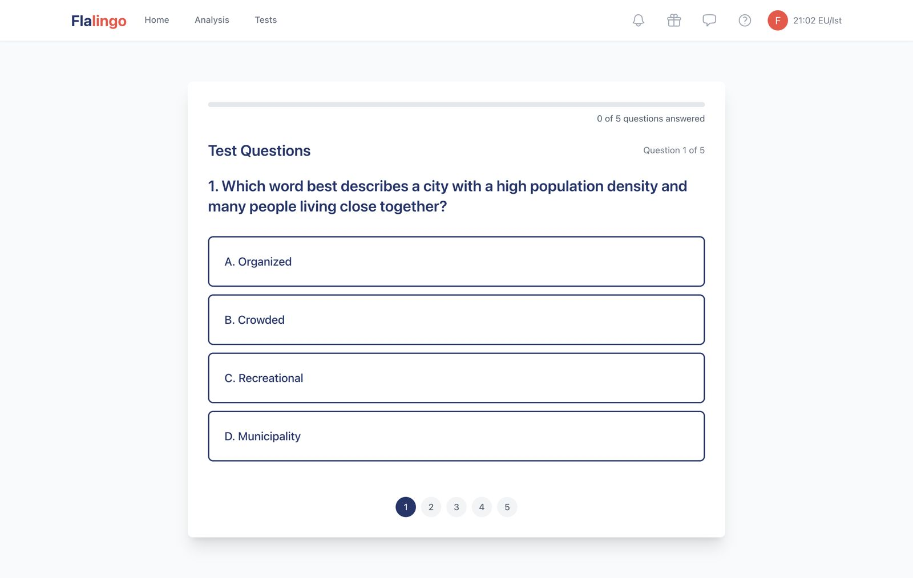
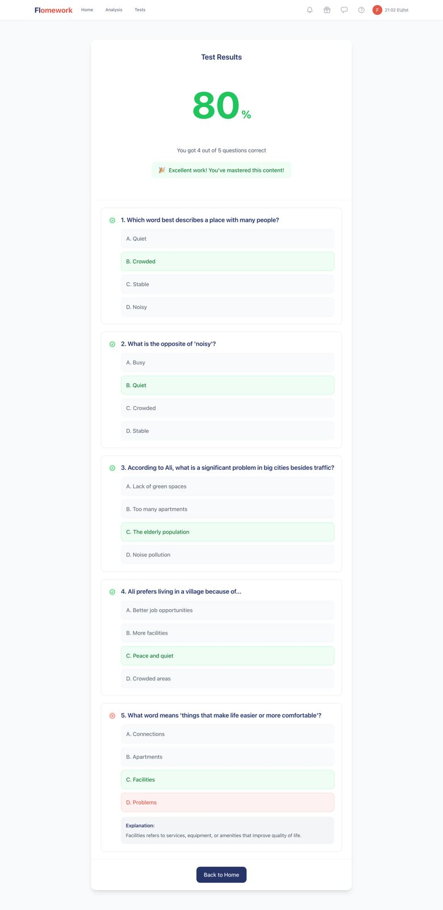
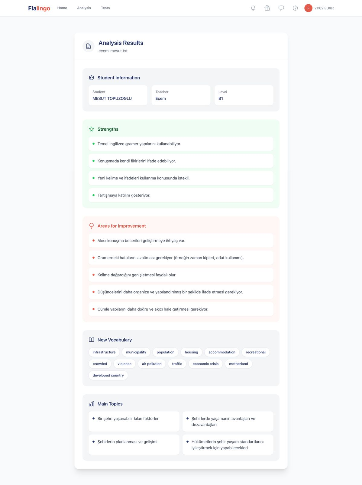

# 🧠 Flalingo – AI-Powered Exercise Generator

An AI-driven system that analyzes lesson transcripts and generates personalized language exercises. Designed as a full-stack feature prototype to enhance digital learning experiences at scale.

---

## 🎯 Project Goals

- Turn raw lesson transcripts into smart, dynamic questions  
- Assist teachers and students with auto-generated exercises  
- Present results and analytics in a clean, user-friendly UI  

---

## 📸 Screenshots

| Home | Take Test | Test Result | Analysis |
|------|-----------|-------------|----------|
|  |  |  |  |

> From uploading a lesson transcript to viewing AI-generated results and insights.

---

## 🎥 Demo Video

> Click to watch the full end-to-end flow of the application in action.

---

## ✨ Features

- 🧠 AI-powered transcript analysis using LLM models  
- 📄 Automatic question generation (multiple choice, fill-in-the-blank)  
- 🧪 Custom test flow with real-time scoring  
- 📊 Visual analytics with charts and performance insights  
- 🌐 Full-stack structure with React (frontend) + Laravel/Python (backend)

---

## ⚙️ Technologies Used

- **Frontend:** React.js, Tailwind CSS  
- **Backend:** Laravel (PHP), Python  
- **AI Integration:** Gemini Flash model  
- **Tools:** Chart.js, Axios, RESTful APIs

---

## 🧪 Example Flow

> - Upload a Zoom lesson transcript  
> - The AI analyzes and generates personalized questions  
> - The user completes the test  
> - Results and performance analytics are shown

---

## 📦 Status

✅ Prototype complete  
🏆 Selected for product integration at Flalingo

---

## 📧 Contact

[ferhatsli63@gmail.com](mailto:ferhatsli63@gmail.com)  
[linkedin.com/in/ferhat-taşlı-674953218](https://linkedin.com/in/ferhat-ta%C5%9Fl%C4%B1-674953218)

---
